<div align="center">


</div>

---

<!-- ── THEME: REST API response ─────────────────────────── -->
## `GET /api/whoiam`

```json
{
    "status": 200,
    "data": {
        "name": "Abdelrahman Kamel",
        "title": "Backend Developer",
        "location": "Egypt 🇪🇬  [UTC+2]",
        "uptime": "available 24/7 for cool projects",
        "core_skills": [
            "RESTful & GraphQL API Design",
            "Microservices & Event-Driven Architecture",
            "Database Modeling & Query Optimization",
            "Auth Systems  (JWT · OAuth2 · Sessions)"
        ],
        "currently": {
            "building": "Scalable backend systems",
            "learning": [
                "System Design patterns",
                "AWS Cloud"
            ],
            "focus_on": [
                "REST APIs",
                "Microservices",
                "System Design"
            ],
            "open_to": "Exciting backend opportunities"
        },
        "config": {
            "coffee_dependency": true,
            "favourite_http": 418,
            "debug_strategy": "console.log first, ask questions later...",
            "principle": "Write code humans can read, machines can run, and future-you won't curse."
        }
    }
}
```

---

<!-- ── THEME: YAML config ───────────────────────────────── -->
## `stack.yml`
 
<div align="center">
<table width="80%">
<tr>
<td valign="middle" width="50%">
 
```yaml
developer:
  name: Abdelrahman Kamel
  title: Backend Developer
  status: production-ready

stack:
  languages:
    - C#
    - Java
    - JavaScript
    - TypeScript
    - Python

  frameworks_and_runtimes:
    - .NET
    - Spring
    - NodeJS
    - NestJS

  databases_and_orms:
    - MySQL
    - MongoDB
    - Redis
    - Prisma

  devops_and_tools:
    - Docker
    - Git
    - GitHub
    - Postman
```
 
</td>
<td valign="middle" width="50%">
<div align="center">
 
**Languages**
 

 
<br/><br/>
 
**Frameworks & Runtimes**
 

 
<br/><br/>
 
**Databases & ORMs**
 

 
<br/><br/>
 
**DevOps & Tools**
 

 
</div>
</td>
</tr>
</table>
</div>

---

<!-- ── THEME: SQL query ────────────────────────────────── -->
## `metrics.sql`

<table width="100%">
<tr>
<td valign="top" width="50%">

```sql
-- ──────────────────────────────────
--  Querying developer stats
--  from github.db
-- ──────────────────────────────────
SELECT
    total_commits,
    pull_requests,
    repositories,
    current_streak,
    longest_streak,
    top_languages
FROM
    github_stats
WHERE
    username = 'abdelrahman-kamel-elgendy'
    AND year = YEAR (CURDATE ())
ORDER BY
    contributions DESC;

-- ── Result ─────────────────────────
-- rows returned : 1
-- execution time: 0.003s
-- status        : 200 OK
-- cache         : HIT
-- ──────────────────────────────────

-- ── Indexes used ───────────────────
-- idx_username  (seek)
-- idx_year      (seek)
-- idx_contributions (sort)
-- ──────────────────────────────────
```
</td>
<td valign="top" width="60%">
<div align="center">
<!-- Stats auto-generated daily by GitHub Actions → .github/workflows/metrics.yml -->



</div>
</td>
</tr>
</table>

---

<!-- ── THEME: Redis CLI ────────────────────────────────── -->
## `CMD`

```redis
127.0.0.1:6379> KEYS activity:*
1) "activity:contribution_graph"
2) "activity:streak"
3) "activity:last_commit"

127.0.0.1:6379> GET activity:contribution_graph
# ── rendering below ───────────────────────────
```

<div align="center">

</div>

---

<!-- ── THEME: Application log ─────────────────────────── -->
## `daily-backend-tip.log`
 
<!-- TIP_START -->
```log
[2026-03-29 19:30:33.721 +02:00 INF] tip-service Fetching tip of the day...
[2026-03-29 19:30:33.721 +02:00 INF] tip-service Source: tips.json  offset: day_of_year % 365
[2026-03-29 19:30:33.721 +02:00 INF] tip-service Status: OK  →  tip loaded
─────────────────────────────────────────────────────────────────
[2026-03-29 19:30:33.721 +02:00 TIP] tip-service Use a schema registry when working with Kafka to version and validate message schemas.
─────────────────────────────────────────────────────────────────
```
<!-- TIP_END -->
 
---
 
<!-- ── THEME: Application log ─────────────────────────── -->
## `daily-quote.log`
 
<!-- QUOTE_START -->
```log
[2026-03-29 19:30:33.721 +02:00 INF] quote-service Connecting to quotes upstream...
[2026-03-29 19:30:33.721 +02:00 INF] quote-service GET https://zenquotes.io/api/today  →  200 OK
[2026-03-29 19:30:33.721 +02:00 INF] quote-service Message received  →  quote loaded
─────────────────────────────────────────────────────────────────
[2026-03-29 19:30:33.721 +02:00 QOT] quote-service Spend eighty percent of your time focusing on the opportunities of tomorrow rather than the problems of yesterday.
[2026-03-29 19:30:33.721 +02:00 AUT] quote-service Brian Tracy
─────────────────────────────────────────────────────────────────
```
<!-- QUOTE_END -->

---

<!-- ── THEME: TCP handshake ───────────────────────────── -->
## `POST /api/connect`

<div align="center">
<a href="mailto:abdelrahman.kamel.elgendy@gmail.com">
  
</a>
&nbsp;
<a href="https://www.linkedin.com/in/abdelrahman-kamel-elgendy/">
  
</a>

<br/>

> *The best backend is the one nobody notices until it's gone ;)*
</div>